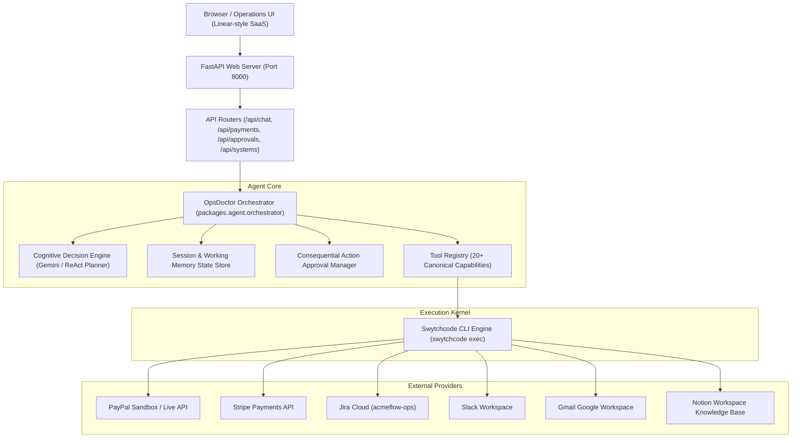

# OpsDoctor Production Deployment & Operations Guide

OpsDoctor is an enterprise-grade autonomous AI operations engineer. It integrates deeply across payment gateways (PayPal, Stripe), issue trackers (Jira), communication channels (Slack, Gmail), and operational knowledge bases (Notion) using **Swytchcode** as its unified tool compilation and execution kernel.

---

## 1. System Architecture



### Key Architectural Tenets:
1. **Capability-First Reasoning**: Tools are chosen based on the user's intent. Queries like *"Any pending payments?"* route directly to payment gateways without touching Jira.
2. **Swytchcode as Sole Execution Kernel**: No ad-hoc HTTP/SDK credentials in application code. Swytchcode securely manages OAuth2 tokens, API keys, and contract schemas.
3. **Dual-Model Cognitive Engine**: Seamlessly leverages Google Gemini (`gemini-3.8-flash` via `@google/genai`) or autonomous multi-turn ReAct reasoning when running in offline/testing mode.
4. **Human-in-the-Loop Safeguards**: Consequential actions (adding Jira comments, initiating refunds, sending notifications) are staged as approval requests requiring operator confirmation.
5. **Progressive Disclosure UX**: High-level incident diagnosis and actionable metrics are front-and-center, with detailed raw execution traces accessible on demand.

---

## 2. Prerequisites & Environment

- **Python**: Version 3.10 or higher (tested on Python 3.13)
- **Swytchcode CLI**: Installed and available in PATH (or specified via `SWYTCHCODE_BIN`)
- **OS**: Linux (Debian, Ubuntu, RHEL), macOS, or Windows Server

### Installing Swytchcode CLI:
```bash
# macOS / Linux
curl -fsSL https://get.swytchcode.com | sh

# Windows (PowerShell)
iwr https://get.swytchcode.com -useb | iex
```

Verify installation:
```bash
swytchcode --version
```

---

## 3. Configuration & Environment Variables

OpsDoctor utilizes `packages.config.Settings` for typed configuration with environment variable overrides.

| Variable | Type | Default | Description |
|---|---|---|---|
| `APP_ENV` | `string` | `production` | Environment mode (`production`, `development`, `testing`) |
| `DEBUG` | `bool` | `false` | Enable verbose error traces and debug output |
| `HOST` | `string` | `127.0.0.1` | Bind IP address for web server |
| `PORT` | `int` | `8000` | Port for web server |
| `GEMINI_API_KEY` | `string` | `""` | Google Gemini API key for LLM cognitive engine |
| `GEMINI_MODEL` | `string` | `gemini-3.8-flash` | Gemini model name |
| `SWYTCHCODE_BIN` | `string` | Auto-detected | Path to the `swytchcode` binary |
| `SWYTCHCODE_TIMEOUT`| `int` | `30` | Timeout in seconds for Swytchcode tool execution |
| `LOG_LEVEL` | `string` | `INFO` | Logging level (`DEBUG`, `INFO`, `WARNING`, `ERROR`) |

Create a `.env` file in the project root:
```ini
APP_ENV=production
DEBUG=false
HOST=0.0.0.0
PORT=8000
GEMINI_API_KEY=your-gemini-api-key-here
GEMINI_MODEL=gemini-3.8-flash
LOG_LEVEL=INFO
```

---

## 4. Swytchcode Provider Authentication

Before launching in production, ensure provider credentials are connected via the Swytchcode CLI:

```bash
# Check provider readiness
swytchcode doctor

# Connect integrations
swytchcode auth connect paypal
swytchcode auth connect Stripe
swytchcode auth connect jira
swytchcode auth connect slack
swytchcode auth connect gmail
swytchcode auth connect notion
```

To verify active tooling:
```bash
swytchcode list tooling
```

---

## 5. Local Running & Testing

### Install Python Dependencies:
```bash
python -m pip install -r requirements.txt
# Or core packages:
pip install fastapi uvicorn pydantic python-dotenv google-genai
```

### Running Test Suite:
```bash
# Run the complete 13-scenario agent capability matrix
python -m unittest tests/test_agent_comprehensive_matrix.py -v

# Run the behavior and regression matrix
python -m unittest tests/test_agent_behavior_matrix.py -v
```

### Launch Web Server:
```bash
python -m uvicorn apps.web.main:app --host 127.0.0.1 --port 8000 --reload
```
Open [http://127.0.0.1:8000](http://127.0.0.1:8000) in your browser.

---

## 6. Production Deployment Options

### Option A: Docker Container

Create `Dockerfile`:
```dockerfile
FROM python:3.11-slim

WORKDIR /app

# Install system dependencies & curl for Swytchcode
RUN apt-get update && apt-get install -y curl ca-certificates && rm -rf /var/lib/apt/lists/*

# Install Swytchcode CLI
RUN curl -fsSL https://get.swytchcode.com | sh
ENV PATH="/root/.swytchcode/bin:${PATH}"

# Install Python requirements
COPY requirements.txt .
RUN pip install --no-cache-dir -r requirements.txt

# Copy application code
COPY . .

# Expose server port
EXPOSE 8000

# Health check probe
HEALTHCHECK --interval=30s --timeout=5s --start-period=10s --retries=3 \
  CMD curl -f http://localhost:8000/api/systems/ready || exit 1

# Launch uvicorn
CMD ["uvicorn", "apps.web.main:app", "--host", "0.0.0.0", "--port", "8000", "--workers", "4"]
```

Build and run:
```bash
docker build -t opsdoctor:latest .
docker run -d \
  --name opsdoctor \
  -p 8000:8000 \
  -v opsdoctor_data:/app/data \
  -e GEMINI_API_KEY="your-gemini-key" \
  -e HOST="0.0.0.0" \
  -e PORT="8000" \
  opsdoctor:latest
```

### Option B: Systemd Service (Linux Host)

Create `/etc/systemd/system/opsdoctor.service`:
```ini
[Unit]
Description=OpsDoctor Autonomous AI Operations Server
After=network.target

[Service]
Type=simple
User=opsuser
WorkingDirectory=/opt/opsdoctor
EnvironmentFile=/opt/opsdoctor/.env
ExecStart=/opt/opsdoctor/venv/bin/uvicorn apps.web.main:app --host 0.0.0.0 --port 8000 --workers 4
Restart=always
RestartSec=5
StandardOutput=journal
StandardError=journal

[Install]
WantedBy=multi-user.target
```

Enable and start the service:
```bash
sudo systemctl daemon-reload
sudo systemctl enable opsdoctor
sudo systemctl start opsdoctor
sudo systemctl status opsdoctor
```

---

## 7. Reverse Proxy & TLS (Nginx)

Place OpsDoctor behind an Nginx reverse proxy for SSL termination and static file caching:

```nginx
server {
    listen 80;
    server_name opsdoctor.acmeflow.internal;
    return 301 https://$host$request_uri;
}

server {
    listen 443 ssl http2;
    server_name opsdoctor.acmeflow.internal;

    ssl_certificate /etc/letsencrypt/live/opsdoctor.acmeflow.internal/fullchain.pem;
    ssl_certificate_key /etc/letsencrypt/live/opsdoctor.acmeflow.internal/privkey.pem;

    location / {
        proxy_pass http://127.0.0.1:8000;
        proxy_http_version 1.1;
        proxy_set_header Upgrade $http_upgrade;
        proxy_set_header Connection "upgrade";
        proxy_set_header Host $host;
        proxy_set_header X-Real-IP $remote_addr;
        proxy_set_header X-Forwarded-For $proxy_add_x_forwarded_for;
        proxy_set_header X-Forwarded-Proto $scheme;
        proxy_read_timeout 120s;
    }
}
```

---

## 8. Health Checks & Observability

OpsDoctor provides standard health and system readiness endpoints:

- **Liveness Probe**:
  `GET /healthz` -> `{"status": "ok", "app": "OpsDoctor"}`
- **Readiness Probe**:
  `GET /api/systems/ready` -> Returns status of all providers (PayPal, Stripe, Jira, Slack, Gmail, Notion) and overall operational readiness.
- **Provider Status Overview**:
  `GET /api/systems` -> Detailed status of each integrated system.
- **Payment Metrics API**:
  `GET /api/payments/overview` -> Total volume, success/pending/failed counts across gateways.
  `GET /api/payments/pending` -> Filtered list of pending transactions.
  `GET /api/payments/compare` -> Gateway comparison metrics.

---

## 9. Security & Governance

1. **Zero Secret Footprint in Source Code**: Secrets are never hardcoded or checked into Git. Swytchcode encrypts credentials locally or delegates to managed OAuth2 providers.
2. **Consequential Action Approvals**: Any write or escalation action is staged in `packages/agent/approvals.py` and requires human approval via `/api/approvals/{id}/approve` before Swytchcode executes the call.
3. **Session Audit Trail**: Full reasoning steps, tool payloads, and raw execution outputs are preserved in structured JSON files under `data/sessions/` for complete post-incident forensic reviews.
