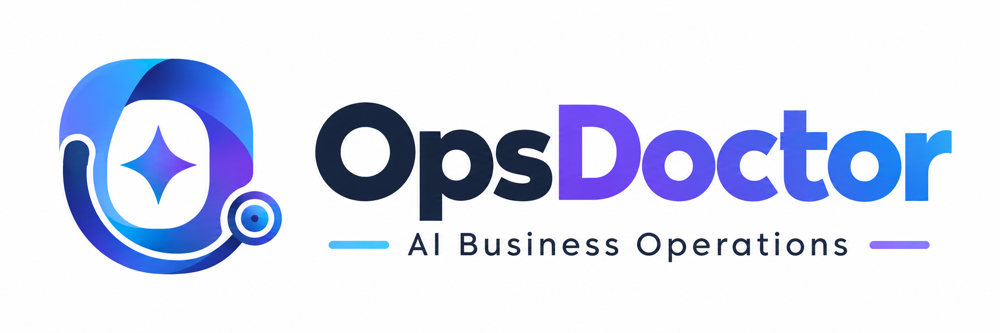
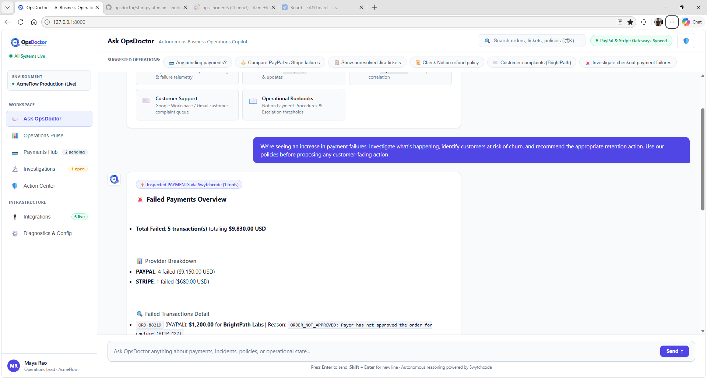
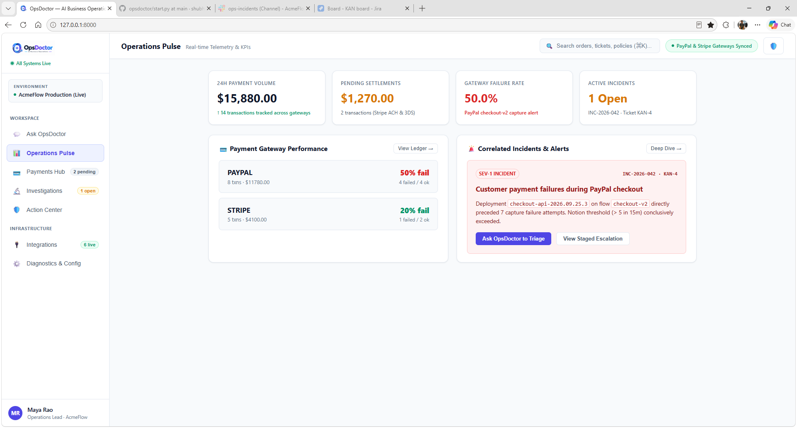
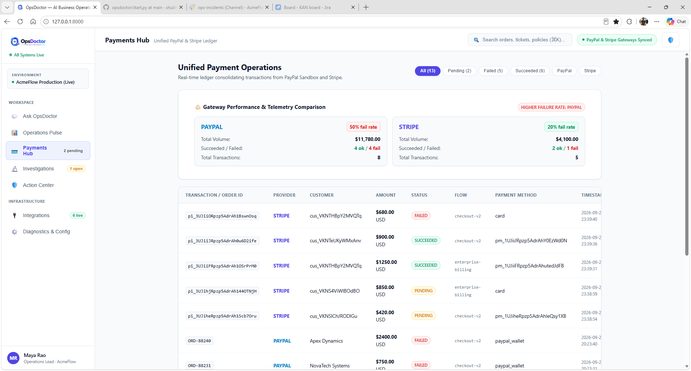
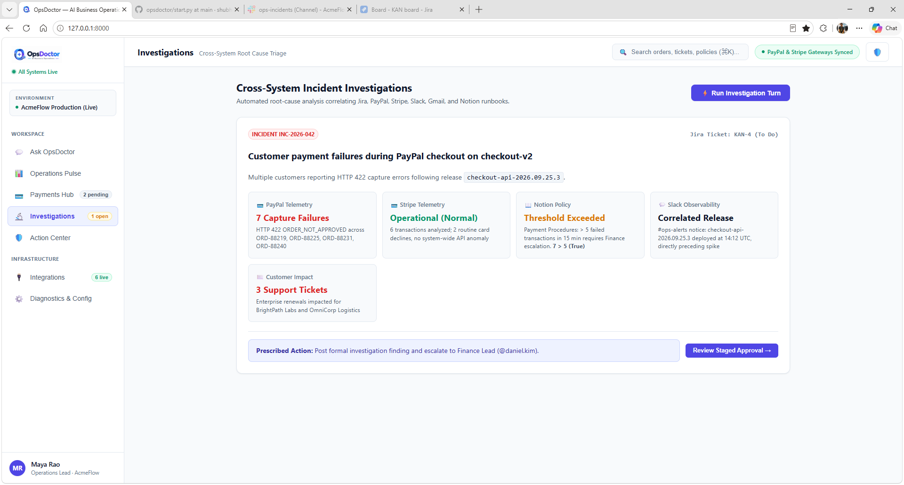
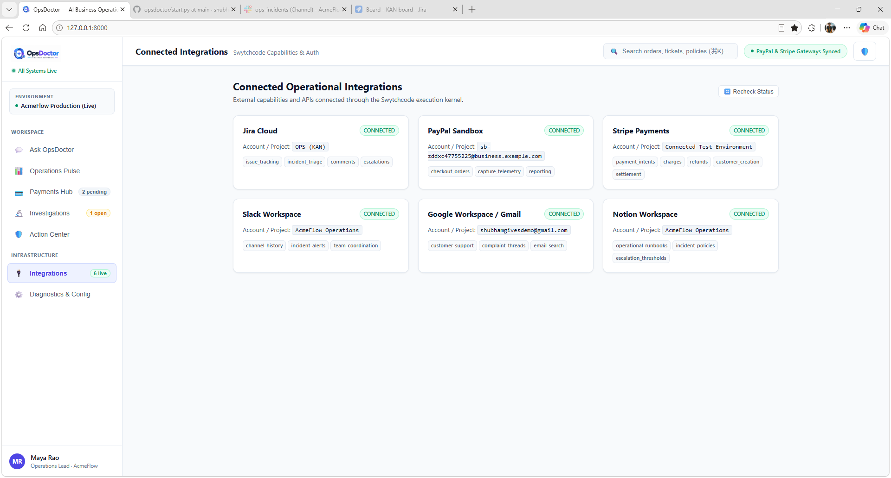
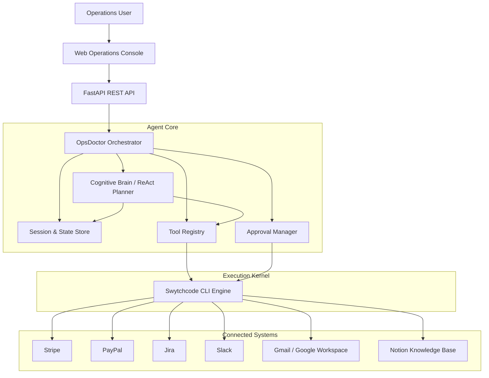

<p align="center">
  
</p>

<p align="center">
  <strong>Investigate. Reason. Validate. Act.</strong>
</p>


> OpsDoctor is an agentic AI operations assistant that turns fragmented operational signals into evidence-backed decisions and safe next actions.

[](https://github.com/shubhamranswal/opsdoctor)
[](https://www.python.org/)
[](#-how-the-agent-works)
[](#-swytchcode-as-the-execution-kernel)

---

## 📌 Overview

OpsDoctor is an **agentic AI operations platform** designed to help teams investigate business issues, correlate evidence across connected systems, validate decisions against operational policies, and safely execute consequential actions.

Instead of behaving like a static dashboard or a chatbot that simply answers questions, OpsDoctor operates as a **capability-first cognitive agent**:

1. Understand the operational request.
2. Determine what capabilities and systems are relevant.
3. Execute the required tools through Swytchcode.
4. Inspect and reason over the returned observations.
5. Gather additional evidence when necessary.
6. Validate proposed actions against the Knowledge Base / operational policies.
7. Stage consequential actions for human approval.
8. Execute approved actions through Swytchcode.
9. Preserve evidence and execution history for auditability.

The result is a workflow that moves from:

**"What happened?" → "Why did it happen?" → "Who or what is affected?" → "What should we do?" → "Is that action allowed?" → "Execute safely."**

---

## 🎯 What Problem Does OpsDoctor Solve?

Modern operations teams work across a fragmented stack:

- Payment gateways
- Email
- Slack
- Jira
- Knowledge bases and SOPs
- Customer support conversations
- Operational dashboards

The problem is rarely a lack of data. The problem is connecting the right evidence at the right time and turning it into an actionable decision.

OpsDoctor provides an agentic layer across these systems.

### Example

A team notices several payment failures.

A traditional dashboard might show:

```text
5 failed payments
$9,830 affected
4 PayPal
1 Stripe
```

OpsDoctor can continue the investigation:

```text
Payment failures
      ↓
Identify affected transactions
      ↓
Gather customer / operational context
      ↓
Retrieve relevant policies and SOPs
      ↓
Assess the operational situation
      ↓
Validate the proposed action
      ↓
Prepare an evidence-backed recommendation
      ↓
Request human approval
      ↓
Execute the approved action
```

This makes the agent useful not only for **incident detection**, but for **operational decision-making and customer retention workflows**.

---

# 🌟 Key Capabilities

## 1. 🧠 Capability-First Agentic Reasoning

OpsDoctor routes requests according to operational intent rather than following a single hardcoded waterfall.

Examples:

- **Payments & Treasury**
  - Pending payments
  - Failed payments
  - Provider-specific payment investigations
  - Cross-provider comparisons

- **Incident Triage & Evidence Synthesis**
  - Investigate operational failures
  - Correlate payment telemetry with other business signals
  - Gather evidence across multiple systems
  - Continue investigation when the first observation is insufficient

- **Support & Communication**
  - Search customer sentiment and complaint threads
  - Correlate support conversations with operational incidents

- **Policy & Compliance**
  - Retrieve SOPs and operational policies
  - Check thresholds and permitted actions
  - Use policy evidence when validating recommendations

---

## 2. 💳 Multi-Provider Payment Intelligence

OpsDoctor integrates payment operations across:

### Stripe

Supports live test-mode operational data including:

- PaymentIntents
- Charges
- Customers
- Refunds
- Payment states such as:
  - `requires_action`
  - `requires_payment_method`
  - `succeeded`
  - `card_declined`

### PayPal

Supports sandbox operational data including:

- Orders
- Capture telemetry
- Capture failures
- Provider responses

### Unified Payment View

The agent normalizes observations from connected providers so operations teams can reason about payment health across gateways instead of inspecting each provider separately.

---

## 3. 🔎 Evidence-Driven Investigations

OpsDoctor can perform multi-hop investigations instead of stopping after the first API response.

A typical investigation can move through:

```text
Payment Gateway
      ↓
Transaction / Failure Evidence
      ↓
Customer Context
      ↓
Slack / Gmail Signals
      ↓
Notion SOP / Knowledge Base
      ↓
Jira Investigation
      ↓
Evidence Synthesis
```

The agent records tool observations in its working state so later reasoning steps can build on earlier results.

---

## 4. 📚 Knowledge Base & Policy Validation

Operational actions should not be based purely on model intuition.

OpsDoctor can retrieve official SOPs and operational policies from the connected Knowledge Base and use them as evidence when evaluating a proposed action.

The intended decision pattern is:

```text
Observed Evidence
       ↓
Proposed Action
       ↓
Relevant Policy / SOP
       ↓
Validation
       ↓
Allowed / Requires Approval / Escalate
```

This creates a clear distinction between:

- **What the systems observed**
- **What the agent inferred**
- **What the organization permits**
- **What action is ultimately executed**

---

## 5. 🛡️ Human-in-the-Loop Safety

OpsDoctor does not silently mutate business state.

Consequential operations are staged as **Approval Requests** before execution.

Examples include:

- Adding Jira incident comments
- Initiating refunds
- Dispatching announcements
- Other consequential operational writes

Operators can review:

- The proposed action
- The rationale
- Affected systems
- Tool and evidence context
- Exact execution payload

Only approved actions are executed through Swytchcode.

---

## 6. 💬 Multi-Turn Operational Memory

OpsDoctor maintains context across operational conversations.

Example:

```text
Turn 1
"Show me pending payments."

        ↓

Turn 2
"Which ones are stuck?"

        ↓

Turn 3
"Why is the Meridian payment stuck?"

        ↓

Turn 4
"Check whether this violates any operational policy."

        ↓

Turn 5
"Escalate it."
```

The agent can use the accumulated context to continue the investigation instead of treating every message as an isolated request.

---

## 7. 🖥️ Operations Console

OpsDoctor includes a web-based operations console with dedicated operational surfaces:

### Ask OpsDoctor

Conversational interface for interacting with the agent and observing its activity.

### Operations Pulse

High-level operational telemetry and recent transaction visibility.

### Payments Hub

Unified Stripe and PayPal payment visibility with status filters and transaction drill-downs.

### Investigations

Investigation history and cross-system evidence views.

### Approvals Center

Review, approve, or reject staged operational actions.

---

# 🖼️ Product Screenshots

## Ask OpsDoctor



Conversational agent interface with operational reasoning and activity traces.

## Operations Pulse



Operational overview and telemetry.

## Payments Hub



Cross-provider payment visibility.

## Investigations



Investigation history and evidence.

## Integrations



Connected operational systems and integrations.

---

# 🏗️ Architecture




---

# 🧩 Core Components

| Component | Responsibility |
|---|---|
| **Web Operations Console** | User-facing operations experience |
| **FastAPI API Layer** | HTTP endpoints for agent, payments, approvals, and systems |
| **OpsDoctor Orchestrator** | Coordinates the agent loop, tools, state, evidence, and approvals |
| **Cognitive Brain** | Determines what the agent should do next |
| **ReAct Planner** | Supports iterative reasoning and tool selection |
| **Tool Registry** | Central registry for canonical operational capabilities |
| **Session & State Store** | Preserves conversational and investigation state |
| **Approval Manager** | Handles human approval for consequential actions |
| **Swytchcode** | Secure execution kernel and integration layer |
| **External Providers** | Stripe, PayPal, Jira, Slack, Gmail, and Notion |

---

# 🤖 How the Agent Works

OpsDoctor follows an iterative agent loop rather than a fixed workflow.

```text
┌───────────────────────────┐
│       User Request        │
└─────────────┬─────────────┘
              ↓
┌───────────────────────────┐
│   Understand Intent       │
└─────────────┬─────────────┘
              ↓
┌───────────────────────────┐
│ Select Relevant Capability│
└─────────────┬─────────────┘
              ↓
┌───────────────────────────┐
│ Execute Tool via          │
│ Swytchcode                │
└─────────────┬─────────────┘
              ↓
┌───────────────────────────┐
│ Inspect Observation       │
└─────────────┬─────────────┘
              ↓
        More evidence?
          /       \
        YES        NO
         ↓          ↓
   Select next     Synthesize
      tool          result
         ↓            ↓
         └──────┬─────┘
                ↓
┌───────────────────────────┐
│ Validate Proposed Action  │
│ against Policy / KB       │
└─────────────┬─────────────┘
              ↓
       Consequential?
          /       \
        YES        NO
         ↓          ↓
     Approval      Return
         ↓         Result
      Approved?
       /     \
     YES      NO
      ↓        ↓
   Execute    Stop
      ↓
   Audit
```

The important distinction is that the **agent decides what it needs to do next based on the current evidence**.

---

# ⚡ Swytchcode as the Execution Kernel

OpsDoctor uses **Swytchcode** as its secure integration and execution layer.

Rather than embedding provider credentials and API-specific execution logic throughout the application, OpsDoctor routes canonical capabilities through Swytchcode.

Connected systems include:

- Stripe
- PayPal
- Jira
- Slack
- Gmail
- Notion

This gives the agent a consistent execution boundary while keeping provider authentication outside the application code.

---

# 🔐 Security & Safety

OpsDoctor follows a zero-secret application architecture.

### Zero Committed Secrets

The project does not store bearer tokens, private keys, or passwords in source code.

### Encrypted Credential Handling

Third-party credentials are managed through Swytchcode's encrypted local keychain.

### Redacted Execution Logs

Sensitive authorization headers and tokens are removed from execution traces.

### Human Approval Gates

Consequential write operations require explicit operator approval before execution.

### Evidence Before Action

The agent is designed to gather evidence and validate proposed actions before executing consequential operations.

---

# 🚀 Getting Started

## Prerequisites

- Python 3.10+
- Python 3.13 tested
- Swytchcode CLI installed
- Access to the providers you intend to connect

Verify the CLI:

```bash
swytchcode --version
```

---

## 1. Clone the Repository

```bash
git clone https://github.com/shubhamranswal/opsdoctor.git
cd opsdoctor
```

Install Python dependencies:

```bash
pip install -r requirements.txt
```

---

## 2. Verify Swytchcode

```bash
swytchcode doctor
```

Connect the required providers:

```bash
swytchcode auth connect Stripe
swytchcode auth connect paypal
swytchcode auth connect jira
swytchcode auth connect slack
swytchcode auth connect gmail
swytchcode auth connect notion
```

You only need to connect the providers required for the capabilities you want to use.

---

## 3. Seed Stripe Test Data

OpsDoctor includes an optional script for populating a connected Stripe test environment with realistic operational transactions.

```bash
python scripts/seed_stripe_test_data.py
```

The seeded scenarios include examples such as:

- Successful payments
- 3DS / additional-action payments
- Incomplete payment-method flows
- Card declines
- Refunds

---

## 4. Start the Application

```bash
python -m uvicorn apps.web.main:app --host 127.0.0.1 --port 8000 --reload
```

Open:

```text
http://127.0.0.1:8000
```

---

# 🧪 Testing

OpsDoctor includes automated verification suites covering agent behavior, tool routing, approvals, payment integrations, conversational memory, and persistence.

## Product Verification Matrix

```bash
python -m unittest tests/test_opsdoctor_product_matrix.py -v
```

The 15-scenario matrix covers:

1. Pending payment queries avoid unnecessary Jira calls
2. PayPal-specific queries use PayPal
3. Stripe-specific queries use Stripe
4. Cross-provider payment queries inspect connected providers
5. Disconnected providers are not queried
6. Connected-but-empty providers are reported correctly
7. Transaction summaries are derived from observations
8. Follow-up questions retain conversational context
9. The agent can dynamically select multiple tools
10. Consequential actions require approval
11. Approved actions execute through Swytchcode
12. Jira comments use professional formatting
13. Agent answers are derived from actual tool observations
14. Stripe test records come from connected records
15. Restarting the application preserves session state

## Natural Operational Dialogue

```bash
python -m unittest tests/test_natural_flow.py -v
```

This verifies multi-turn operational dialogue and Jira formatting behavior.

## Cross-Domain Agent Matrix

```bash
python -m unittest tests/test_agent_comprehensive_matrix.py -v
```

---

# 📁 Project Structure

A high-level view of the repository:

```text
opsdoctor/
│
├── apps/
│   └── web/
│       └── main.py
│
├── packages/
│   └── agent/
│       ├── orchestrator
│       ├── cognitive brain
│       ├── tool registry
│       └── approval / state management
│
├── scripts/
│   └── seed_stripe_test_data.py
│
├── tests/
│   ├── test_opsdoctor_product_matrix.py
│   ├── test_natural_flow.py
│   └── test_agent_comprehensive_matrix.py
│
├── arch.svg
├── logo_horizontal.png
├── logo_square.png
├── ss_chat.png
├── ss_integrations.png
├── ss_investigations.png
├── ss_payments.png
├── ss_pulse.png
├── requirements.txt
└── README.md
```

> The exact package contents may evolve as the agent capabilities grow. The structure above highlights the major application boundaries and repository assets.

---

# 🧭 Operational Domains

OpsDoctor currently organizes its capabilities around several operational domains:

| Domain | Example Questions |
|---|---|
| 💳 **Payments** | "What payments are pending?" |
| 🔍 **Investigations** | "Why did this payment fail?" |
| 📚 **Policy** | "Does this action comply with our SOP?" |
| 💬 **Support** | "Are customers reporting this issue?" |
| 🚨 **Incidents** | "Should this operational issue be escalated?" |
| 🛡️ **Approvals** | "What actions are waiting for approval?" |
| 📈 **Operations Pulse** | "What is happening across our connected systems?" |

---

# 🎬 Demo Scenario

A representative OpsDoctor workflow:

### 1. Detect

```text
"We're seeing payment failures."
```

### 2. Investigate

OpsDoctor inspects connected payment providers and identifies the affected transactions.

### 3. Correlate

The agent gathers additional context from connected operational systems where relevant.

### 4. Understand Customer Impact

The investigation can move beyond transaction status to the affected customer's operational context.

### 5. Validate

OpsDoctor retrieves the relevant Knowledge Base / SOP information and validates the proposed operational response.

### 6. Recommend

The agent presents:

- What happened
- What evidence supports the conclusion
- Which customers / systems are affected
- What action is being proposed
- Why the action is appropriate
- Which policy or operational guidance supports it

### 7. Approve

A human operator reviews the proposed consequential action.

### 8. Execute

Once approved, the action is executed through Swytchcode and recorded for auditability.

---

# 🧱 Design Principles

OpsDoctor is built around a few core principles.

### Evidence over assumptions

Agent responses should be grounded in actual tool observations.

### Capabilities over workflows

The agent chooses capabilities based on operational intent instead of following one giant predefined workflow.

### Policy before action

Operational policies and SOPs should inform consequential decisions.

### Human control

The agent can prepare and reason about consequential actions, but humans remain in control of execution.

### Secure execution

Provider credentials and external execution are isolated behind Swytchcode.

### Conversational continuity

Operational investigations can span multiple turns without losing context.

### Observable reasoning

Tool activity, evidence, and approval state should remain inspectable by operators.

---

# 🗺️ Roadmap

The architecture is designed to grow beyond the current payment and operations scenarios.

Potential extensions include:

- Expanded customer retention intelligence
- More Knowledge Base sources
- Additional payment providers
- Additional CRM and support integrations
- More operational remediation capabilities
- Richer investigation graphs
- Expanded policy validation
- Additional approval workflows
- More comprehensive deployment automation
- Broader automated agent evaluation

The goal is to evolve OpsDoctor from an operations assistant into a reusable **AI operations control plane** for businesses.

---

# 🤝 Contributing

Contributions are welcome.

A good contribution should generally:

1. Add or improve a clearly defined capability.
2. Keep provider execution behind the integration layer.
3. Preserve evidence-driven agent behavior.
4. Avoid committing credentials or secrets.
5. Add or update tests for meaningful behavior changes.
6. Preserve human approval for consequential operations.

Suggested workflow:

```bash
git checkout -b feature/your-capability
```

Make your changes, add tests, and open a pull request with:

- What changed
- Why it changed
- Which capability it affects
- How it was tested
- Any new provider configuration required

---

# 🐛 Troubleshooting

### Check Swytchcode

```bash
swytchcode doctor
```

### Check provider authentication

```bash
swytchcode auth
```

Reconnect the provider if required.

### Run the automated tests

```bash
python -m unittest tests/test_opsdoctor_product_matrix.py -v
```

### Start the application locally

```bash
python -m uvicorn apps.web.main:app --host 127.0.0.1 --port 8000 --reload
```

---

# 📄 License

Add the repository's chosen open-source license here before publishing the repository as a public open-source project.

For example, if the project is intended to use MIT:

```text
MIT License
```

Do not claim a license until the corresponding `LICENSE` file has been added to the repository.

---

# 🙌 Acknowledgements

Built as an agentic AI operations project around **Swytchcode** integrations and execution.
