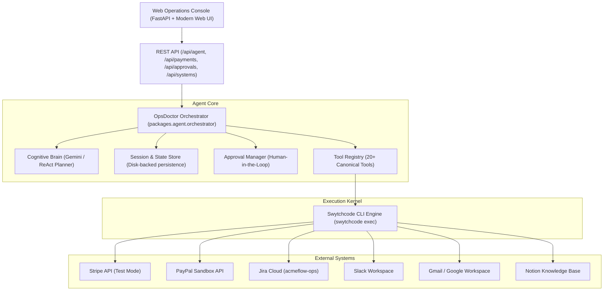

# 🩺 OpsDoctor — Autonomous AI Business Operations Engineer

**OpsDoctor** is an enterprise-grade AI Operations Agent that investigates incidents, monitors cross-provider payments, audits knowledge base policies, coordinates cross-team escalations, and executes safe operational remediations.

Unlike brittle deterministic workflows or toy chatbots, OpsDoctor utilizes a **capability-first cognitive ReAct loop** coupled with **Swytchcode** as its secure execution kernel and compiler target.

---

## 🌟 Key Capabilities

### 1. Capability-First Multi-Domain Intelligence
OpsDoctor routes user requests based on true operational intent rather than hardcoded waterfalls:
- **Payments & Treasury**: Queries like *"Any pending payments?"* or *"Compare payment failures across gateways"* route directly to connected payment gateways (PayPal & Stripe) without invoking Jira.
- **Incident Triage & Evidence Synthesis**: Multi-hop root-cause investigations start with real-time gateway failure telemetry, correlating logs with Slack alerts, Gmail customer complaints, and Notion runbooks before branching into Jira.
- **Support & Communication**: Search customer sentiment and complaint threads across Gmail and incident alert channels in Slack.
- **Policy & Compliance**: Verifies operational actions and escalation thresholds against official SOPs and runbooks hosted in Notion.

### 2. Live Payment Gateway Integration via Swytchcode
- **Stripe Payments**: Queries live test-mode PaymentIntents, charges, customers, and refunds. Handles complex statuses (`requires_action` 3DS challenges, `requires_payment_method` incomplete checkouts, `succeeded`, `card_declined`).
- **PayPal Sandbox**: Monitors capture telemetry, orders, and failure responses.
- **Unified Payment Aggregation**: Normalizes transaction schemas across gateways to deliver real-time operational pulse and bottleneck metrics.

### 3. Human-in-the-Loop Safeguards
OpsDoctor strictly prevents unauthorized state mutations:
- Consequential actions (adding Jira incident comments, initiating refunds, dispatching announcements) are automatically staged as **Approval Requests**.
- Operators review the rationale, affected systems, and exact JSON payloads before approving or rejecting execution.
- Approved actions execute strictly through Swytchcode with complete audit logging.

### 4. Multi-Turn Conversational Memory
Maintains cross-turn context across extended operational dialogues:
```text
Turn 1: "Show me pending payments"
         ↳ Returns live multi-gateway summary ($1,270.00 pending across Stripe)
Turn 2: "Which ones are stuck?"
         ↳ Identifies specific bottlenecks (3DS auth challenge & incomplete checkout)
Turn 3: "Why is the Meridian payment stuck?"
         ↳ Investigates Meridian Tech's specific transaction held in requires_payment_method
Turn 4: "Check whether this violates any operational policy"
         ↳ Audits Notion SOPs to confirm payment delay threshold
Turn 5: "Escalate it"
         ↳ Stages a professionally formatted Jira comment awaiting human approval
```

### 5. Linear-Style Web Operations Console
A SaaS web console (`http://localhost:8000`) featuring:
- **Ask OpsDoctor**: Real-time streaming conversational agent interface with collapsible activity traces.
- **Operations Pulse**: High-level telemetry dashboards with live gateway metrics and recent transactions.
- **Payments Hub**: Unified visibility across Stripe and PayPal with status filters and transaction drill-downs.
- **Investigations**: Incident investigation history and cross-system evidence graphs.
- **Approvals Center**: Action staging, operator inspection, and one-click execution.

---

## 🏗️ Architecture



---

## 🚀 Getting Started

### Prerequisites
- Python 3.10+ (tested on Python 3.13)
- Swytchcode CLI installed (`swytchcode --version`)

### 1. Installation
Fork, Clone the repository and install dependencies:
```bash
git clone https://github.com/<your_username>/opsdoctor.git
cd opsdoctor
pip install -r requirements.txt
```

### 2. Swytchcode Provider Authentication
OpsDoctor leverages Swytchcode for secure credential handling. No external API keys or secrets are stored in code or `.env`:
```bash
# Verify Swytchcode installation and tooling
swytchcode doctor

# Connect providers (developer connects once via interactive CLI)
swytchcode auth connect Stripe
swytchcode auth connect paypal
swytchcode auth connect jira
swytchcode auth connect slack
swytchcode auth connect gmail
swytchcode auth connect notion
```

### 3. Seed Realistic Stripe Test Data (Optional)
To populate the connected Stripe test environment with realistic operational transactions (succeeded, 3DS action required, awaiting payment method, card declined, refund):
```bash
python scripts/seed_stripe_test_data.py
```

### 4. Launch the Web Application
```bash
python -m uvicorn apps.web.main:app --host 127.0.0.1 --port 8000 --reload
```
Open [http://127.0.0.1:8000](http://127.0.0.1:8000) to access the OpsDoctor Operations Console.

---

## 🧪 Comprehensive Automated Test Suites

OpsDoctor includes comprehensive test suites validating all capability domains and architectural guarantees:

### 1. The 15-Scenario Product Verification Matrix
Verifies the complete product specification:
```bash
python -m unittest tests/test_opsdoctor_product_matrix.py -v
```
**Scenarios Covered:**
1. `test_01_pending_payment_query_does_not_call_jira`
2. `test_02_paypal_specific_query_uses_paypal`
3. `test_03_stripe_specific_query_uses_stripe`
4. `test_04_cross_provider_payment_query_checks_connected_providers`
5. `test_05_disconnected_providers_are_not_queried`
6. `test_06_connected_but_empty_providers_reported_empty`
7. `test_07_no_hardcoded_transaction_summaries_returned`
8. `test_08_followup_questions_retain_conversational_context`
9. `test_09_agent_dynamically_selects_multiple_tools_when_needed`
10. `test_10_consequential_actions_require_approval`
11. `test_11_approved_actions_execute_through_swytchcode`
12. `test_12_jira_comments_use_proper_professional_formatting`
13. `test_13_agent_answers_derived_from_actual_tool_observations`
14. `test_14_stripe_test_records_are_real_connected_records`
15. `test_15_restarting_application_preserves_session_state`

### 2. Multi-Turn Natural Operational Dialogue Test
Verifies natural 5-turn dialogue progression and Jira wiki markup:
```bash
python -m unittest tests/test_natural_flow.py -v
```

### 3. Cross-Domain Agent Behavior Matrix
```bash
python -m unittest tests/test_agent_comprehensive_matrix.py -v
```

---

## 🛡️ Security & Zero-Secret Architecture

1. **Zero Committed Secrets**: OpsDoctor does not store or log any bearer tokens, private keys, or passwords.
2. **Encrypted Key Management**: All third-party credentials reside in Swytchcode's encrypted local keychain.
3. **Redacted Execution Logs**: Sensitive headers (`Authorization`, tokens) are stripped from execution traces.
4. **Approval Gateways**: Consequential write methods require human verification before execution.

---

## 📖 Production Deployment

For Docker containerization, systemd daemon configuration, health probes, and Kubernetes manifests, see [DEPLOYMENT.md](./DEPLOYMENT.md).
